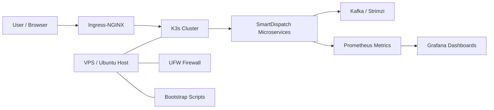

# Infrastructure

This folder contains the VPS bootstrap path for SmartDispatch.

## What It Sets Up

- Ubuntu package baseline for a Kubernetes host
- `k3s` single-node Kubernetes cluster
- `ingress-nginx` as the reverse proxy layer
- Strimzi Kafka operator for the Kafka CRs in `manifests/kafka-strimzi.yaml`
- Firewall rules with `ufw`

## Scripts

- `scripts/bootstrap-vps.sh` prepares a fresh VPS
- `scripts/deploy-app.sh` runs the Ansible-based platform deployment

## Deployment View

## Typical Flow

1. Provision or create a VPS running Ubuntu 24.04.
2. Run `sudo bash infra/scripts/bootstrap-vps.sh` on the VPS.
3. Install Ansible on the deployment machine if needed.
4. Run `bash infra/scripts/deploy-app.sh` to install the SmartDispatch stack.

## Notes

- The ingress controller listens on host ports `80` and `443`.
- The Kubernetes API is available on `6443` for administration.
- Monitoring dashboards can be exposed through ingress or port-forwarded locally.